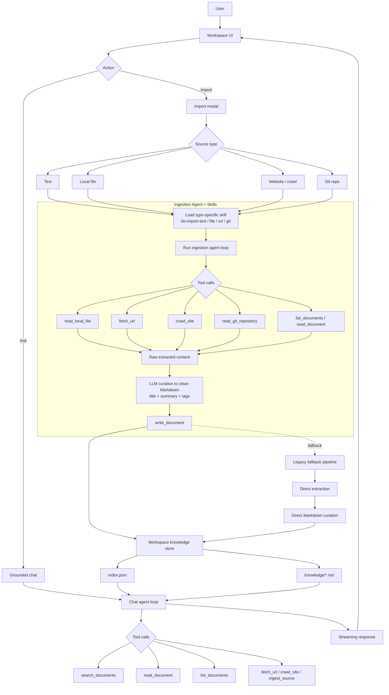

# omykb — Open My Knowledge Base

Local-first AI knowledge base with two faces:

- `skills/`: Claude Code style slash-command skills
- `app/`: Electron desktop app for importing sources and grounded chat

There is no backend service in this repo. Knowledge is stored on disk in Markdown.

---

## What Works Today

## Main Flow



### Desktop app

- NotebookLM-style workspace UI:
  - left rail for workspaces
  - source list / import panel
  - grounded chat on the same screen
- Multiple workspaces
- Settings UI for:
  - LLM provider and API key
  - model selection
  - storage path
  - custom system prompt
  - skill inspection/editing
- Local knowledge storage in Markdown + `index.json`

### Import / ingestion

The app can ingest these source types:

- Raw text
- Local files
- Website URL
- Recursive same-domain website crawl
- Git repository URL
- Images via model vision

Supported local file formats currently include:

- `pdf`
- `docx`
- `pptx`
- `xlsx` / `xls`
- `csv`
- `json`
- `html` / `xml`
- `md` / `txt`
- `ipynb`
- common image formats

Ingestion flow:

1. Extract raw content
2. Run AI curation into a structured Markdown note
3. Save note to workspace storage
4. Update document index metadata

### Chat

- Streaming LLM chat
- Tool-driven agent loop
- Knowledge base tools:
  - `list_documents`
  - `read_document`
  - `search_documents`
  - `write_document`
  - `fetch_url`
  - `crawl_site`
  - `read_local_file`
  - `read_git_repository`
  - `ingest_source`
- Slash-command skill loading from:
  - `~/.claude/skills`
  - bundled repo `skills/`

---

## Current Limits

This repo is still a local desktop prototype, not a full production knowledge platform.

Not implemented end-to-end in the current code:

- S3 / R2 / MinIO storage
- Git storage backend
- Notion / Yuque / RSS sync
- Semantic vector search
- strict source citation UI like real NotebookLM
- graph / export / team-sharing workflows inside the desktop app

The skill Markdown files describe the broader product direction. The Electron app implements a practical subset of that direction today.

---

## Repo Structure

```text
omykb/
├── app/                    # Electron desktop app
│   ├── electron/           # Main process, IPC, agent tools
│   ├── src/                # React renderer
│   ├── assets/             # App icons
│   ├── scripts/            # Utility scripts (icon generation, notarize)
│   └── package.json
├── skills/                 # Bundled Claude Code skills (.md)
├── website/                # Marketing/docs site (Vite + React)
└── README.md
```

Important app files:

- [app/electron/main.ts](./app/electron/main.ts)
- [app/electron/agent.ts](./app/electron/agent.ts)
- [app/src/App.tsx](./app/src/App.tsx)
- [app/src/pages/Workspace.tsx](./app/src/pages/Workspace.tsx)
- [app/src/pages/Chat.tsx](./app/src/pages/Chat.tsx)

---

## Desktop App

### Run locally

```bash
cd app
npm install
npm start
```

### Build

```bash
cd app
npm run build
```

### Package for macOS

Unsigned local package:

```bash
cd app
npm run dist
```

This produces artifacts under `app/release/`, typically:

- `omykb-<version>-x64.zip`
- `omykb-<version>-x64.dmg`

Signed + notarized package:

```bash
cd app

export CSC_NAME="Developer ID Application: YOUR NAME (TEAMID)"
export APPLE_ID="your-apple-id@example.com"
export APPLE_APP_SPECIFIC_PASSWORD="xxxx-xxxx-xxxx-xxxx"
export APPLE_TEAM_ID="TEAMID"

npm run dist:signed
```

Relevant packaging files:

- [app/package.json](./app/package.json)
- [app/build/entitlements.mac.plist](./app/build/entitlements.mac.plist)
- [app/scripts/notarize.js](./app/scripts/notarize.js)

---

## Storage Layout

App config is stored in Electron `userData`.

Default knowledge path:

```text
~/Documents/omykb/
```

Within that directory, the app creates workspace-scoped storage:

```text
omykb/
└── workspaces/
    ├── ws_<id>/
    │   ├── .omykb/
    │   │   └── index.json
    │   └── knowledge/
    │       └── *.md
    └── ws_<id>/
        ├── .omykb/
        └── knowledge/
```

Workspace metadata is stored separately in Electron `userData` as `workspaces.json`.

---

## Skills

Bundled skills live in [`skills/`](./skills).

Current bundled commands:

- `/kb:init`
- `/kb:add`
- `/kb:ask`
- `/kb:search`
- `/kb:organize`
- `/kb:sync`
- `/kb:status`
- `/kb:graph`
- `/kb:export`
- `/kb:config`
- `/kb:team`

In the desktop app, skills are loaded dynamically and can be inspected or edited from Settings.

---

## Website

The `website/` directory is a separate Vite app for marketing/docs.

```bash
cd website
npm install
npm run dev
npm run build
```

---

## Development Notes

- The desktop app is Electron + React + Tailwind + esbuild.
- The import pipeline prefers local parsing first, then AI curation into Markdown.
- For some office-style formats, the app can opportunistically use `markitdown` via `uvx` if available on the machine.
- macOS app icon assets are generated from:
  - [app/scripts/generate_icon.py](./app/scripts/generate_icon.py)

---

## License

MIT
